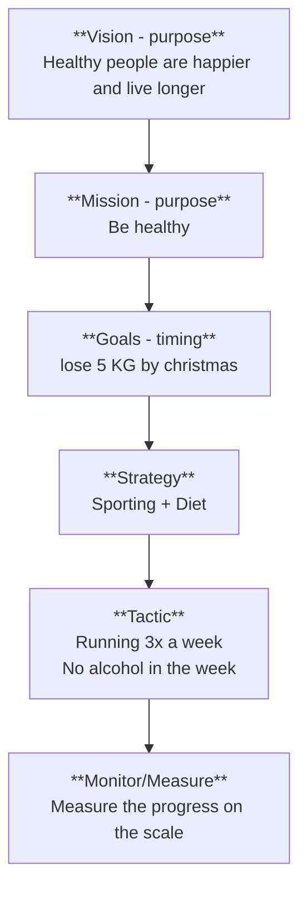

---
{"dg-publish":true,"permalink":"/1-strategy-and-leadership/1-business-strategy/"}
---

---
23-oct-2025 class by Koen Vandenbempt
Written flipcharts in class, see: [[Flipcharts-Business-Strategies-Vandenbempt.pdf]]

Business strategy in essence is quite simple it is: "dealing with the environment"
**But there is no magic formula** because the business strategy is dependent om a lot of factors like, sector, size, culture, company structure.

Figure 1: Traditional business structure

**Elements of a good strategy**
- The strategy is seen as a continuous process
- Communication
- Change management
- No silo-thinking
- Early engagement of IT-people
- Empathy and understanding of eachother and of the company
- Choose the right narrative of the strategy for the best engagement

**Challenges of a strategy**
- The risks are unknown
- Lack of alignment (see [[1. Strategy & Leadership/Digital Strategy & Transformation\|Digital Strategy & Transformation]])
- Speed of change
- Not having equal partners with a similar mindset
- Lack of adaptability and flexibility
- Ongoing business as usual (cannot stop or pause the rest of the business)
- Defining the ROI of IT (investments)
- Existing people, structures and culture

**Dimensions of Strategic Boundaries**
These dimensions are almost always already set and cannot be changed. The red line is an example company with the circled dynamics.

When a company like GM (General Motors) has been in the automotive industry for a long time innovation usually slows down. A lot of innovation is still done in the industry but a lot of these new companies do not survive (red spikes). When a new company does succeed in their innovation like Tesla it will surpass the market leader because it has more progress of customer value. The trick for GM is to do market research for these weak signals to detect the new trend and innovation to adapt the company. The hard part is to differentiate weak signals from failing companies from weak signals of companies that will be serious competition in the future.

# 800

==⚠  Switch to EXCALIDRAW VIEW in the MORE OPTIONS menu of this document. ⚠== You can decompress Drawing data with the command palette: 'Decompress current Excalidraw file'. For more info check in plugin settings under 'Saving'

# Excalidraw Data

## Text Elements
Traditional company
(GM) 
Weak signals 
Innovative company
(Tesla) 
Time 
Progress of customer value 

To detect these weak signals you have to be **OEN** Open, Eerlijk, Naief. So that you can reflect, without any bias on what the customer wants. When being **OEN** you can monitor the **CAC**, the Customer Activity Cycle. These are the signals coming from customers (like really wanting an electric car).
**How to read the weak signals?**
1. Sense the market and make sense of what you see
2. Seize the opportunity
3. Transform the business-model

In a difficult market customers are in pain. When customers are in pain they are open to business. This is a new market opportunity!

**Ambidextrous strategy**

# 800

==⚠  Switch to EXCALIDRAW VIEW in the MORE OPTIONS menu of this document. ⚠== You can decompress Drawing data with the command palette: 'Decompress current Excalidraw file'. For more info check in plugin settings under 'Saving'

# Excalidraw Data

## Text Elements
ST
Stability 
LT
Change 
Ambidexterity (Bimodal) 
## Embedded Files
7a47083bb22ce3041dfe1bd01abe0a5f6b11ce0f: [[Pasted Image 20251025183023_486.png]]

The short-term strategy should be on stability (if you are making money, good keep doing so). The long-term strategy should be on change, if there is no innovation the business will not survive for long. The term ambidexterity means writing with two hands equally, so the trick is to correctly balance the ST strategy and the LT strategy.

**Customer Advantage**

The model above is the overview of how to create, keep and lose the customer advantage.
In the model 2 example companies are used, BAM and ASML.

1. When in the top left a company is having a lot of customer advantage like ASML (70%) it has a lot of free cash-flow which can be spent on innovation to keep the customer advantage position. Due to market dynamics and competition that cash will over time be spend on keeping the business running (OPEX).
2. A big helper in this shift is the resource magnet, this magnet will increase the cost of "running the business" and is a shapeshifter. The magnet can be: legislation, audits, AI (without any purpose), politics.
3. There is a problem when like BAM 99% of the revenue is spent on keeping the business running, because then almost no innovation can take place. The first step is to make changes in the organisation to free up money. This can be done by automating time intensive tasks and optimizing business processes. By doing this people will be automated out of their jobs.
4. With the freed up money and people there is now room for exploration of new business ideas. This innovation will be seen as a second engine of the company (like a completely new product). **The dangerous thing that can happen is that the innovation is made available for free as an free update of the existing product** This way the innovation is used to gain a bigger market for the existing product. This is not the intention of the exploration and innovation! Innovation can be done in two organisational ways:
	1. innovation as a separate Business Unit.
	   This way the costs are easy to identify as innovation costs and the innovation does not hinder current business as usual.
	2. innovation in every team.
	   This way the innovation is done everywhere in the company and close to the teams that set the requirements and do acceptance testing.
5. When there is a good new business idea which has proven itself then the idea needs to be up-scaled and incorporated into the business model. This is a 1000-step stairway to take due to existing organisational structures, legislation, infrastructure, etc.

In the OPEX-phase the company needs to work S.M.A.R.T and K.I.S.S.
S.M.A.R.T. = Specific, Measurable, Acceptable, Realistic, Time-bound
K.I.S.S. = Keep It Simple Stupid

In the optimization phase the company needs to work on K.I.S.I.S. 
K.I.S.I.S. = Keeping It Simple Is Stupid

While in the exploration phase the company should focus on being A.M.O.R.A.
A.M.O.R.A. = Ambition Motivation Original Relevant Authentic

**How to keep Customer Advantage?**
The 5 ways to keep customer advantage are:
1. Category power
   The growth from categories that are new and only exploited by you.
2. Company power
   The growth from all your products combined
3. Market power
   The growth from being the biggest in a single market
4. Offer power
   The growth from not being the biggest, but the best
5. Execution power
   The growth from being the most optimal

 **Integration of AI in the organisation**
 1. The easiest way of integrating AI is in the **infrastructure layer**. By adding tools like copilot and ChatGPT in the desktop environment.
 2. To get more out of AI you need to incorporate it in the **operational model**. By adjusting processes the way of working changes and should consume less FTE and money.
 3. To use AI to the fullest the business model should change to incorporate AI. The business model only is changed if the output is different (like a different customer invoice).